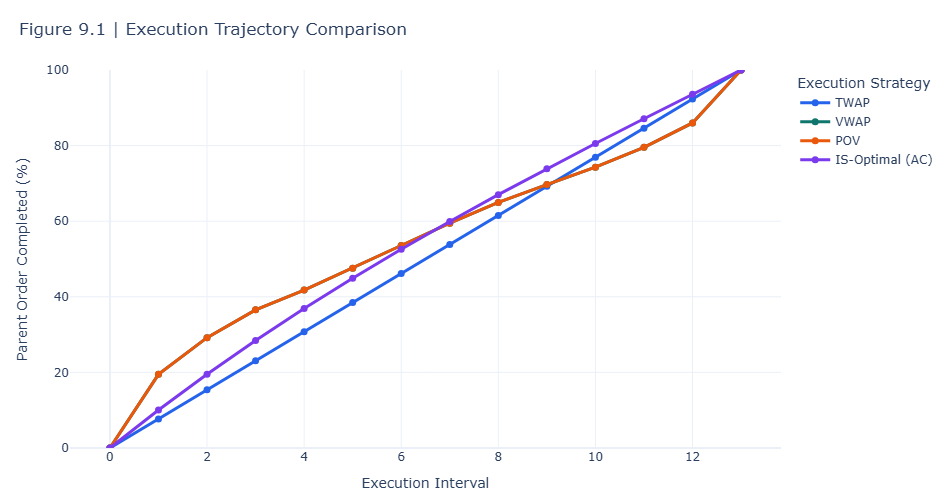
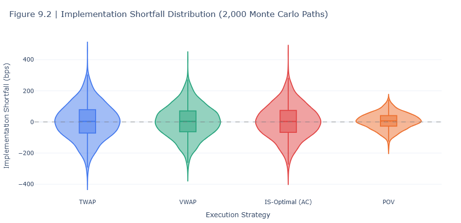
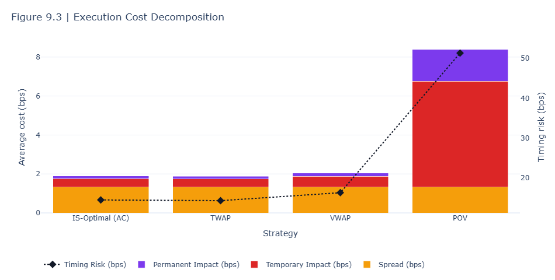
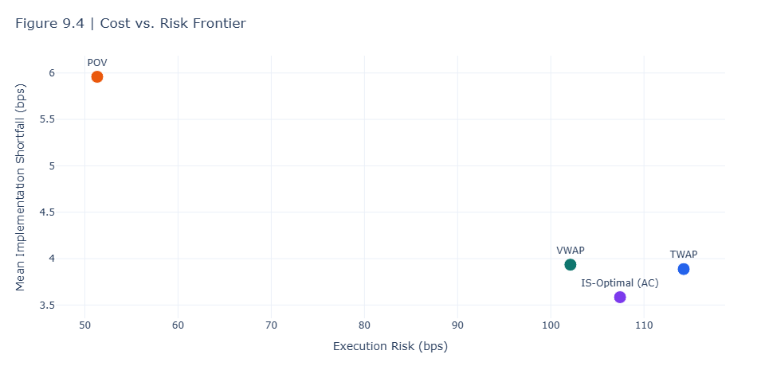

# Institutional Transaction Cost Analysis
## Transaction Cost Analysis and Optimal Execution Analytics using Python

A Python-based framework for analyzing transaction costs and comparing institutional execution strategies using the Almgren–Chriss model and Monte Carlo simulation.

---

## Overview

Large institutional investors cannot execute large equity orders in a single trade without moving the market against themselves. This project develops a Python-based Transaction Cost Analysis (TCA) framework that:

- Pulls real 1-minute intraday equity data (with a synthetic-data fallback for reproducibility)
- Estimates market liquidity from OHLCV data alone (no order book required)
- Calibrates the Almgren–Chriss market impact model
- Simulates and compares four institutional execution strategies
- Evaluates execution quality through Monte Carlo simulation
- Visualizes results with interactive Plotly dashboards

The workflow reflects the analytical process used to evaluate execution strategies under different liquidity and market impact assumptions.

---

## Key Features

- Real 1-minute intraday equity data with a synthetic-data fallback
- Liquidity estimation using the Corwin–Schultz bid-ask spread estimator
- Almgren–Chriss market impact calibration
- TWAP, VWAP, POV, and IS-Optimal execution strategy simulation
- Monte Carlo analysis of execution performance
- Interactive Plotly visualizations for cost, risk, and liquidity analysis

---

## What It Does

| Stage | Description |
| --- | --- |
| **Data Collection** | Retrieves 1-minute intraday OHLCV data using `yfinance`, with a synthetic-data fallback when live data is unavailable. |
| **Liquidity Estimation** | Computes Average Daily Volume (ADV), realized volatility, and the Corwin–Schultz (2012) bid-ask spread estimator. |
| **Market Impact Modeling** | Estimates temporary and permanent market impact coefficients using the Almgren–Chriss framework. |
| **Execution Scheduling** | Creates execution schedules for TWAP, VWAP, POV, and Almgren–Chriss Implementation Shortfall (IS-Optimal) strategies. |
| **Monte Carlo Simulation** | Simulates thousands of price paths to evaluate execution outcomes under different market conditions. |
| **Performance Analytics** | Breaks down implementation shortfall into its cost components and compares execution cost and risk across strategies. |
| **Visualization** | Generates interactive Plotly charts, including liquidity heatmaps, execution trajectories, slippage distributions, cost decomposition, and the cost-risk frontier. |

---

## Quantitative Methods

This project combines several quantitative finance concepts commonly used in transaction cost analysis and optimal execution:

- **Almgren–Chriss Framework** – Models the trade-off between market impact and execution risk to generate optimal execution schedules.
- **Market Impact Modeling** – Separates execution costs into temporary and permanent price impact.
- **Implementation Shortfall** – Measures execution performance relative to the arrival price.
- **Corwin–Schultz Spread Estimator** – Estimates effective bid-ask spreads using daily high and low prices when quote data is unavailable.
- **Monte Carlo Simulation** – Evaluates execution performance across thousands of simulated market scenarios.

---

## Execution Strategies Compared

| Strategy | Description |
| --- | --- |
| **TWAP** | Splits the order into equal-sized trades executed evenly over the trading horizon. |
| **VWAP** | Adjusts trade sizes to follow the historical intraday volume profile. |
| **POV** | Executes a fixed percentage of the market's trading volume as liquidity becomes available. |
| **IS-Optimal (AC)** | Uses the Almgren–Chriss framework to balance expected execution cost and execution risk based on the chosen risk-aversion parameter (λ). |

---

## Example Results

The example below shows the execution performance of four strategies using AAPL intraday data, a 250,000-share parent order, and 2,000 Monte Carlo simulation paths.

| Rank | Strategy | Mean IS (bps) | Execution Risk (bps) | 95th Percentile (bps) |
| --- | --- | ---: | ---: | ---: |
| 1 | IS-Optimal (AC) | 3.58 | 107.43 | 179.12 |
| 2 | TWAP | 3.89 | 114.26 | 190.86 |
| 3 | VWAP | 3.93 | 102.11 | 174.02 |
| 4 | POV | 5.96 | 51.32 | 89.40 |

In this example, the Almgren–Chriss strategy produced the lowest average implementation shortfall, while the POV strategy achieved the lowest execution risk. These results demonstrate the trade-off between execution cost and execution risk across different execution strategies.

*Note: Results are illustrative and will vary depending on the selected ticker, order size, execution horizon, and market conditions.*

### Execution Strategy Comparison



### Implementation Shortfall Distribution



---

## Visualizations

The project includes the following interactive Plotly visualizations:

1. **Intraday Liquidity Heatmap** – Displays trading volume by minute and trading day using a logarithmic color scale.
2. **Average Intraday Volume Profile** – Shows the historical intraday volume pattern used to construct VWAP schedules.
3. **Execution Trajectory Comparison** – Compares cumulative order execution across different strategies.
4. **Implementation Shortfall Distribution** – Visualizes the distribution of implementation shortfall for each execution strategy.
5. **Execution Cost Decomposition** – Breaks down implementation shortfall into spread, temporary impact, permanent impact, and timing risk.
6. **Cost vs. Risk Frontier** – Compares execution strategies based on expected cost and execution risk.
7. **Risk Aversion Sensitivity Analysis** – Illustrates how changing the risk-aversion parameter (λ) affects the optimal execution schedule.
8. **Order Size Scenario Analysis** – Examines how implementation shortfall changes as order size increases relative to average daily volume (ADV).

### Execution Cost Decomposition




---

## Project Structure

```text
Institutional-Transaction-Cost-Analysis/
│
├── README.md                     # Project overview and documentation
├── LICENSE                       # MIT License
├── requirements.txt              # Project dependencies
├── .gitignore                    # Git ignore rules
│
├── notebooks/
│   └── Institutional_Transaction_Cost_Analysis.ipynb
│
├── images/                       # Figures used in the README
├── docs/                         # Supporting documentation
└── report/                       # Technical report (optional)
```

---

## Data Sources

- **Primary:** 1-minute intraday OHLCV market data retrieved from Yahoo Finance using `yfinance`.
- **Fallback:** A synthetic intraday data generator that reproduces realistic volume and volatility patterns when live market data is unavailable.

Yahoo Finance does not provide historical bid-ask quotes or order book data. To estimate transaction costs, the project applies the Corwin–Schultz (2012) estimator to OHLC price data to approximate effective bid-ask spreads.

---

## Tech Stack

| Library | Purpose |
| --- | --- |
| `pandas` / `numpy` | Data manipulation and numerical computing |
| `yfinance` | Intraday market data retrieval |
| `scipy` | Statistical analysis and optimization |
| `statsmodels` | Statistical modeling |
| `plotly` | Interactive data visualization |
| `kaleido` | Exporting Plotly figures as static images |
| `Jupyter Notebook` | Interactive analysis and experimentation

---

## How to Run

1. Open `Institutional_Transaction_Cost_Analysis.ipynb` in Google Colab or Jupyter Notebook.
2. Run the setup cell to install the required dependencies.
3. Update the `CONFIG` dictionary with your preferred ticker, order size, and execution settings.
4. Run the notebook from top to bottom to collect market data (or generate synthetic data if needed), simulate the execution strategies, and produce the analysis and visualizations.

No API keys are required. All market data is retrieved from publicly available Yahoo Finance endpoints.

### Cost vs. Risk Frontier



---

## Configuration

Project settings are managed through a single `CONFIG` dictionary at the beginning of the notebook. Updating these parameters allows you to run the analysis for different tickers, order sizes, execution horizons, and simulation settings without modifying the underlying code.

```python
CONFIG = {
    "TICKER": "AAPL",
    "INTRADAY_PERIOD": "5d",
    "INTRADAY_INTERVAL": "1m",
    "ORDER_SIDE": "BUY",
    "ORDER_SIZE_SHARES": 250_000,
    "PARTICIPATION_TARGET": 0.10,
    "N_SLICES": 13,
    "RISK_AVERSION": 3e-2,
    "N_MC_PATHS": 2_000,
    "RANDOM_SEED": 42,
}
```

---

## Limitations

- Bid-ask spreads are **estimated** from OHLC price data using the Corwin–Schultz estimator, as Yahoo Finance does not provide historical quote or order book data.
- The Almgren–Chriss framework assumes linear market impact for a single asset and execution venue. It does not account for factors such as queue position, adverse selection, or smart order routing.
- Monte Carlo simulations are based on a calibrated market impact model rather than historical order-level data. The results are intended for research and educational purposes and should not be interpreted as live trading signals.

---

## Future Enhancements

Possible extensions to this project include:

- Reinforcement learning-based execution policies.
- Multi-venue execution and smart order routing simulation.
- Limit order book modeling using datasets such as LOBSTER.
- Adverse selection and information leakage modeling.
- Integration with higher-resolution market data sources such as Polygon, IEX Cloud, or NASDAQ TotalView.

---

## Disclaimer

This project is intended for educational and research purposes only. It uses publicly available market data and does not constitute investment or trading advice. The execution models and results are illustrative and should not be used for live trading without further validation.

---

